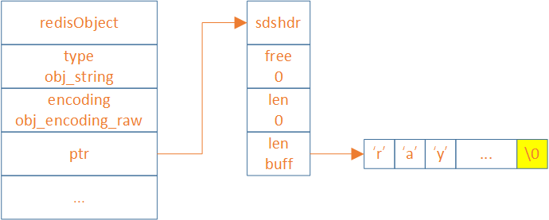
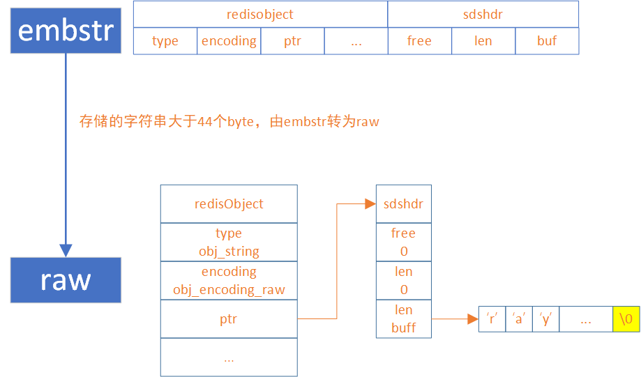
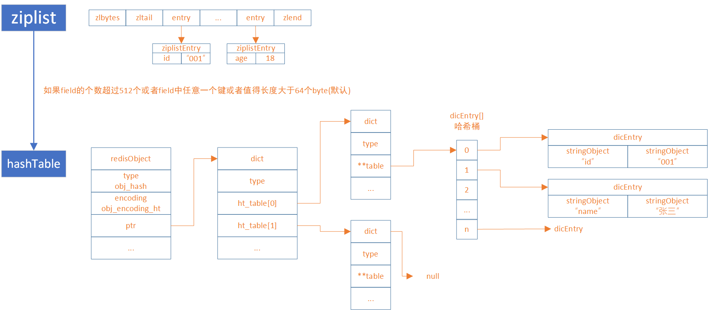
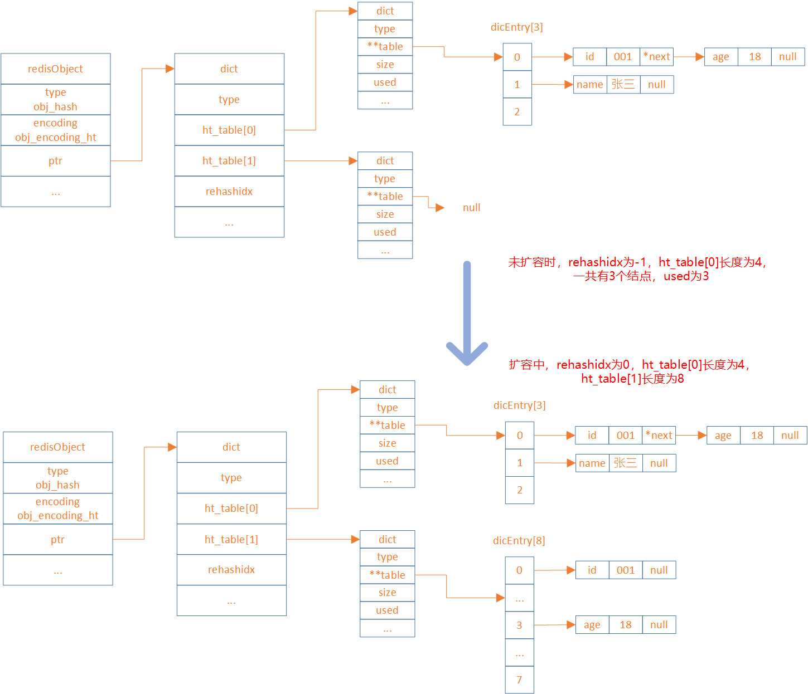
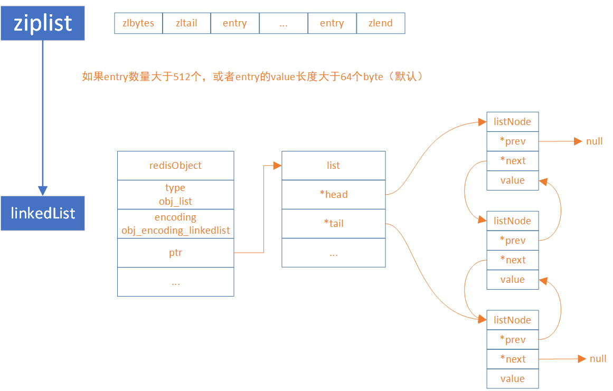
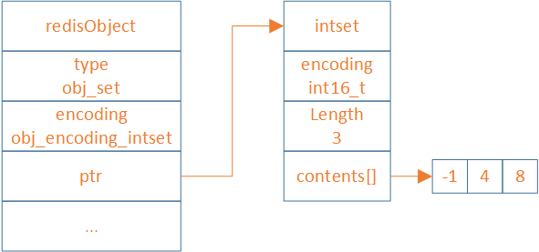
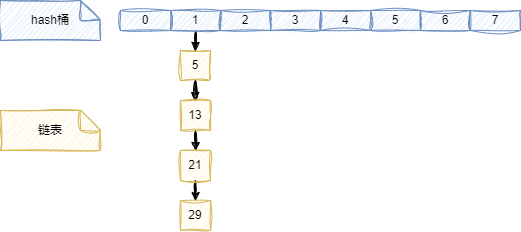

# 五种常用数据类型
## 概述
Redis 是一个开源的高性能键值数据库，它支持多种数据类型，可以满足不同的业务需求。本文将介绍 Redis 的5种常用数据类型，分别是
- string（字符串）
- hash（哈希）
- list（列表）
- set（集合）
- zset（有序集合）


## String
string 是 Redis 最基本的数据类型，它可以存储任意类型的数据，比如文本、数字、图片或者序列化的对象。一个 string 类型的键最大可以存储 512 MB 的数据。

string 类型的底层实现是 SDS（simple dynamic string），它是一个动态字符串结构，由长度、空闲空间和字节数组三部分组成。SDS有3种编码类型：

- embstr：占用64Bytes的空间，存储44Bytes的数据
- raw：存储大于44Bytes的数据
- int：存储整数类型

embstr和raw存储字符串数据，int存储整型数据

### 应用场景

string 类型的应用场景非常广泛，比如：

- 缓存数据，提高访问速度和降低数据库压力。
- 计数器，利用 incr 和 decr 命令实现原子性的加减操作。
- 分布式锁，利用 setnx 命令实现互斥访问。
- 限流，利用 expire 命令实现时间窗口内的访问控制。
### 底层原理

#### embstr结构

embstr 结构存储小于等于44个字节的字符串，embstr 每次开辟64个byte的空间

- 前19个byte用于存储embstr 结构
- 中间的44个byte存储数据
- 最后为`\0`符号

#### raw结构

#### embstr和raw的转换
在存储字符串的时候，redis会根据数据的长度判断使用哪种结构
- 如果长度小于等于44个字节，就会选择embstr 结构
- 如果长度大于44个byte，就会选择raw结构


```
127.0.0.1:6379> object encoding str
"embstr"
# str赋值44个字节的字符串
127.0.0.1:6379> set str 1234567890123456789012345678901234567890abcd
OK
127.0.0.1:6379> object encoding str
"embstr"
# str2赋值45个字节的字符串
127.0.0.1:6379> set str2 1234567890123456789012345678901234567890abcde
OK
127.0.0.1:6379> object encoding str2
"raw"
127.0.0.1:6379> set num 123
OK
127.0.0.1:6379> object encoding num
"int"
```
## Hash
hash 是一个键值对集合，它可以存储多个字段和值，类似于编程语言中的 map 对象。一个 hash 类型的键最多可以存储 2^32 - 1 个字段。

Hash类型的底层实现有三种：

- `ziplist`：压缩列表，当**hash**达到一定的阈值时，会自动转换为`hashtable`结构
- `listpack`：紧凑列表，在Redis7.0之后，`listpack`正式取代`ziplist`。同样的，当**hash**达到一定的阈值时，会自动转换为`hashtable`结构
- `hashtable`：哈希表，类似map
### 应用场景

hash 类型的应用场景主要是存储对象，比如：

- 用户信息，利用 hset 和 hget 命令实现对象属性的增删改查。
- 购物车，利用 hincrby 命令实现商品数量的增减。
- 配置信息，利用 hmset 和 hmget 命令实现批量设置和获取配置项。

### 底层原理

Redis在存储hash结构的数据，为了达到内存和性能的平衡，也针对少量存储和大量存储分别设计了两种结构，分别为：

- ziplist（redis7.0之前使用）和listpack（redis7.0之后使用）
- hashTable

从**ziplist/listpack**编码转换为**hashTable**编码是通过判断**元素数量**或**单个元素Key或Value的长度**决定的：

- `hash-max-ziplist-entries`：表示当**hash**中的元素数量小于或等于该值时，使用**ziplist**编码，否则使用**hashtable**编码。**ziplist**是一种压缩列表，它可以节省内存空间，但是访问速度较慢。**hashtable**是一种哈希表，它可以提高访问速度，但是占用内存空间较多。默认值为**512**。
- `hash-max-ziplist-value`：表示当 **hash**中的每个元素的 `key `和 `value `的长度都小于或等于该值时，使用 **ziplist**编码，否则使用 **hashtable**编码。默认值为 **64**。

#### ziplist与listpack

**ziplist/listpack**都是**hash**结构用来存储少量数据的结构。从**Redis7.0**后，**hash**默认使用**listpack**结构。因为 **ziplist**有一个致命的缺陷，就是**连锁更新**，当一个节点的长度发生变化时，可能会导致后续所有节点的长度字段都要重新编码，这会造成极差的性能

##### ziplist结构

ziplist是一种紧凑的链表结构，它将所有的字段和值顺序地存储在一块连续的内存中。

**Redis中ziplist源码**

```C
typedef struct {
  /* 当使用字符串时,slen表示为字符串长度 */
  unsigned char *sval;
  unsigned int slen;
  /* 当使用整形时，sval为NULL,lval为ziplistEntry的value */
  long long lval;
} ziplistEntry;
```

##### listpack结构

##### zipList的连锁更新问题

ziplist的每个entry都包含previous_entry_length来记录上一个节点的大小，长度是1个或5个byte：

- 如果前一节点的长度小于254个byte，则采用1个byte来保存这个长度值
- 如果前一节点的长度大于等于254个byte，则采用5个byte来保存这个长度值，第一个byte为0xfe，后四个byte才是真实长度数据

假设，现有有N个连续、长度为250~253个byte的entry，因此entry的previous_entry_length属性占用1个btye


当第一节长度大于等于254个bytes，导致第二节**previous_entry_length**变为5个bytes，第二节的长度由250变为254。而第二节长度的增加必然会影响第三节的**previous_entry_length**。ziplist这种特殊套娃的情况下产生的连续多次空间扩展操作成为连锁更新。新增、删除都可能导致连锁更新的产生。
##### listpack是如何解决的


1. 由于ziplist需要倒着遍历，所以需要用previous_entry_length记录前一个entry的长度。而listpack可以通过total_bytes和end计算出来。所以previous_entry_length不需要了。
2. listpack 的设计彻底消灭了 ziplist 存在的级联更新行为，元素与元素之间完全独立，不会因为一个元素的长度变长就导致后续的元素内容会受到影响。
3. 与ziplist做对比的话，牺牲了内存使用率，避免了连锁更新的情况。从代码复杂度上看，listpack相对ziplist简单很多，再把增删改统一做处理，从listpack的代码实现上看，极简且高效。
#### hashTable

hashTable是一种散列表结构，它将字段和值分别存储在两个数组中，并通过哈希函数计算字段在数组中的索引


**Redis中hashTable源码**

```C
struct dict {
    dictType *type;
    dictEntry **ht_table[2];
    unsigned long ht_used[2];
    long rehashidx; /* 当进行rehash时，rehashidx为-1 */
    int16_t pauserehash; /* 如果rehash暂停，pauserehash则大于0，（小于0表示代码错误）*/
    signed char ht_size_exp[2]; /* 哈希桶的个数(size = 1<<exp) */
};

typedef struct dict {
    dictEntry **table;
    dictType *type;
    unsigned long size;
    unsigned long sizemask;
    unsigned long used;
    void *privdata;
} dict;

typedef struct dictEntry {
    void *key;
    void *val;
    struct dictEntry *next;
} dictEntry;
```

#### ziplist和hashTable的转换




```Bash
127.0.0.1:6379> hset h1 id 123456789012345678901234567890123456789012345678901234567890abcd
(integer) 1
127.0.0.1:6379> object encoding h1
"ziplist"
127.0.0.1:6379> hset h2 id 123456789012345678901234567890123456789012345678901234567890abcde
(integer) 1
127.0.0.1:6379> object encoding h2
"hashtable"

```

##### ziplist的废弃

显然是ziplist在field个数太大、key太长、value太长三者有其一的时候会有以下问题：

1. ziplist每次插入都有开辟空间，连续的
2. 查询的时候，需要从头开始计算，查询速度变慢

#### hashTable变得越来越长怎么办

扩容，hashTabel是怎么扩容的？使用的是渐进式扩容`rehash`。`rehash`会重新计算哈希值，且将哈希桶的容量扩大。

##### rehash 步骤



扩展哈希和收缩哈希都是通过执行`rehash`来完成，这其中就涉及到了空间的分配和释放，主要经过以下五步：

1. 为字典dict的ht[1]哈希表分配空间，其大小取决于当前哈希表已保存节点数（即：`ht[0].used`）：
    - 如果是扩展操作则ht[1]的大小为2的n次方中第一个大于等于`ht[0].used * 2`属性的值（比如used=3，此时`ht[0].used * 2=6`，故2的3次方为8就是第一个大于used * 2的值（2 的 2 次方 6））。
    - 如果是收缩操作则ht[1]大小为 2 的 n 次方中第一个大于等于`ht[0].used`的值
2. 将字典中的属性`rehashidx`的值设置为0，表示正在执行`rehash`操作
3. 将ht[0]中所有的键值对依次重新计算哈希值，并放到ht[1]数组对应位置，每完成一个键值对的`rehash`之后rehashidx的值需要自增1
4. 当ht[0]中所有的键值对都迁移到ht[1]之后，释放ht[0]，并将ht[1]修改为ht[0]，然后再创建一个新的ht[1]数组，为下一次rehash做准备
5. 将字典中的属性`rehashidx`设置为-1，表示此次`rehash`操作结束，等待下一次`rehash`

##### 渐进式 rehash

Redis中的这种重新哈希的操作因为不是一次性全部`rehash`，而是分多次来慢慢的将ht[0]中的键值对`rehash`到ht[1]，故而这种操作也称之为渐进式`rehash`。渐进式`rehash`可以避免集中式`rehash`带来的庞大计算量，是一种分而治之的思想。

在渐进式`rehash`过程中，因为还可能会有新的键值对存进来，此时Redis的做法是新添加的键值对统一放入ht[1]中，这样就确保了ht[0]键值对的数量只会减少。

当正在执行`rehash`操作时，如果服务器收到来自客户端的命令请求操作，则**会先查询****ht[0]****，查找不到结果再到****ht[1]****中查询**

## List
list 是一个有序的字符串列表，它按照插入顺序排序，并且支持在两端插入或删除元素。一个 list 类型的键最多可以存储 2^32 - 1 个元素。

`redis3.2`以后，list 类型的底层实现只有一种结构，就是quicklist。版本不同时，底层实现是不同的，下面会讲解。

### 应用场景

list 类型的应用场景主要是实现队列和栈，比如：

- 消息队列，利用 lpush 和 rpop 命令实现生产者消费者模式。
- 最新消息，利用 lpush 和 ltrim 命令实现固定长度的时间线。
- 历史记录，利用 lpush 和 lrange 命令实现浏览记录或者搜索记录。

### 底层原理

在讲解list结构之前，需要先说明一下list结构编码的更替，如下

- 在`Redis3.2`之前，list使用的是`linkedlist`和`ziplist`
- 在`Redis3.2~Redis7.0`之间，list使用的是`quickList`，是`linkedlist`和`ziplist`的结合
- 在`Redis7.0`之后，list使用的也是`quickList`，只不过将`ziplist`转为`listpack`，它是listpack、linkedlist结合版

#### linkedlist与ziplist

在`Redis3.2`之前，`linkedlist`和`ziplist`两种编码可以选择切换，它们之间的转换关系如图



同样地，ziplist转为linkedlist的条件可在redis.conf配置

```.properties
list-max-ziplist-entries 512
list-max-ziplist-value 64
```

#### quickList（ziplist、linkedlist结合版）

`quicklist`存储了一个双向列表，每个列表的节点是一个`ziplist`，所以实际上`quicklist`并不是一个新的数据结构，它就是`linkedlist`和`ziplist`的结合，然后被命名为快速列表。


ziplist内部entry个数可在redis.conf配置

```.properties
list-max-ziplist-size -2
# -5: 每个ziplist最多为 64 kb  <-- 影响正常负载，不推荐
# -4: 每个ziplist最多为 32 Kb  <-- 不推荐
# -3: 每个ziplist最多为 16 Kb  <-- 最好不要使用
# -2: 每个ziplist最多为 8 Kb   <-- 好
# -1: 每个ziplist最多为 4 Kb   <-- 好
# 正数为ziplist内部entry个数

```

ziplist通过特定的LZF压缩算法来将节点进行压缩存储，从而更进一步的节省空间，而很多场景都是两端元素访问率最高，我们可以通过配置`list-compress-depth`来排除首尾两端不压缩的entry个数。

```.properties
list-compress-depth 0
# - 0：不压缩（默认值）
# - 1：首尾第 1 个元素不压缩
# - 2：首位前 2 个元素不压缩
# - 3：首尾前 3 个元素不压缩
# - 以此类推
```

#### quickList（listpack、linkedlist结合版）

和Hash结构一样，因为`ziplist`有连锁更新问题，`redis7.0`将`ziplist`替换为`listpack`，下面是新quickList的结构图


**Redis中listpack源码**

```C
typedef struct quicklist {
    quicklistNode *head;
    quicklistNode *tail;
    unsigned long count;        /* 所有列表包中所有条目的总数，占用16 bits，最大65536 */
    unsigned long len;          /* quicklistNode 的数量 */
    signed int fill : QL_FILL_BITS;       /* 单个节点的填充因子 */
    unsigned int compress : QL_COMP_BITS; /* 不压缩的端节点深度；0=off */
    unsigned int bookmark_count: QL_BM_BITS;
    quicklistBookmark bookmarks[];
} quicklist;
```

```C
typedef struct quicklistNode {
    struct quicklistNode *prev;
    struct quicklistNode *next;
    unsigned char *entry;
    size_t sz;             /* 当前entry占用字节 */
    unsigned int count : 16;     /* listpack元素个数，最大65535 */
    unsigned int encoding : 2;   /* RAW==1 or LZF==2 */
    unsigned int container : 2;  /* PLAIN==1 or PACKED==2 */
    unsigned int recompress : 1; /* 当前listpack是否需要再次压缩 */
    unsigned int attempted_compress : 1; /* 测试用 */
    unsigned int extra : 10; /* 备用 */
} quicklistNode;
```

listpack内部entry个数可在redis.conf配置

```.properties
List-Max-listpack-size -2
# -5: 每个listpack最多为 64 kb  <-- 影响正常负载，不推荐
# -4: 每个listpack最多为 32 Kb  <-- 不推荐
# -3: 每个listpack最多为 16 Kb  <-- 最好不要使用
# -2: 每个listpack最多为 8 Kb   <-- 好
# -1: 每个listpack最多为 4 Kb   <-- 好
# 正数为listpack内部entry个数
```

## Set

`set `是一个无序的字符串集合，它不允许重复的元素。一个 `set `类型的键最多可以存储 2^32 - 1 个元素

`set `类型的底层实现有两种：

- `intset`，整数集合
-  `hashtable`（哈希表）。哈希表和 hash 类型的哈希表相同，它将元素存储在一个数组中，并通过哈希函数计算元素在数组中的索引

Redis 会根据 set 中元素的数量和类型来选择合适的编码方式，当 set 达到一定的阈值时，会自动转换编码方式


```C

typedef struct intset {
    uint32_t encoding;
    uint32_t length;
    int8_t contents[];
} intset;

```

### 应用场景

set 类型的应用场景主要是利用集合的特性，比如：

- 去重，利用 sadd 和 scard 命令实现元素的添加和计数。
- 交集，并集，差集，利用 sinter，sunion 和 sdiff 命令实现集合间的运算。
- 随机抽取，利用 srandmember 命令实现随机抽奖或者抽样。

### 底层原理

在讲解set结构之前，需要先说明一下set结构编码的更替，如下

- 在`Redis7.2`之前，set使用的是`intset`和`hashtable `
- 在`Redis7.2`之后，set使用的是`intset`、`listpack`、`hashtable `

#### intset

`intset`是一种紧凑的数组结构，它只保存`int`类型的数据，它将所有的元素按照从小到大的顺序存储在一块连续的内存中。`intset`会根据传入的数据大小，`encoding`分为`int16_t`、`int32_t`、`int64_t`



```Bash
127.0.0.1:6379> sadd set 123
(integer) 1
127.0.0.1:6379> object encoding set
"intset"
127.0.0.1:6379> sadd set abcd
(integer) 1
127.0.0.1:6379> object encoding set
"hashtable"
```

#### intset 和 hashtable 的转换

在`Redis7.2`之前，当一个集合满足以下两个条件时，Redis 会选择使用`intset`编码：

- 集合对象保存的所有元素都是整数值
- 集合对象保存的元素数量小于等于`512`个（默认）

intset最大元素数量可在redis.conf配置

```.properties
set-max-intset-entries 512
```

#### 为什么加入了listpack

在`redis7.2`之前，`sds`类型的数据会直接放入到编码结构式为`hashtable`的`set`中。其中，`sds`其实就是`redis`中的`string`类型。

而在`redis7.2`之后，sds类型的数据，首先会使用`listpack`结构当 `set `达到一定的阈值时，才会自动转换为`hashtable`。

添加`listpack`结构是为了提高内存利用率和操作效率，因为 hashtable 的空间开销和碰撞概率都比较高。

##### hashtable 的空间开销高

hashtable 的**空间开销**高是因为它需要预先分配一个固定大小的数组来存储键值对，而这个数组的大小通常要大于实际存储的元素个数，以保证较低的装载因子。装载因子是指 hashtable 中已经存储的元素个数和数组大小的比值，它反映了 hashtable 的空间利用率

- 如果装载因子过高，那么 hashtable 的性能会下降，因为碰撞的概率会增加
- 如果装载因子过低，那么 hashtable 的空间利用率会下降，因为数组中会有很多空闲的位置

因此，hashtable 需要在装载因子和空间利用率之间做一个平衡，通常装载因子的推荐值是 0.75

##### hashtable 的碰撞概率高

`hashtable` 的**碰撞概率**高是因为它使用了一个散列函数来将任意长度的键映射到一个有限范围内的整数，作为数组的索引

散列函数的设计很重要，它应该尽可能地保证不同的键能够均匀地分布在数组中，避免出现某些位置过于拥挤，而其他位置过于稀疏的情况。然而，由于散列函数的输出范围是有限的，而键的取值范围是无限的，所以不可能完全避免两个不同的键被散列到同一个位置上，这就产生了碰撞。碰撞会影响 hashtable 的性能，因为它需要额外的处理方式来解决冲突，比如开放寻址法或者链地址法

举例说明，假设有一个大小为8的`hashtable`，使用取模运算作为散列函数，即h(k) = k mod 8。现在有四个键：5，13，21，29，它们都被散列到`索引1`处



这就是一个碰撞的例子，因为四个键都映射到了同一个索引。这种情况可能是由于以下原因造成的：

- 散列函数的选择不合适，没有充分利用hashtable的空间。
- 键的分布不均匀，有些区间的键出现的频率更高。
- hashtable的大小太小，不能容纳所有的键。

为了解决碰撞，`redis`采用了**链地址法**。就是在每个索引处维护一个链表，存储所有散列到该索引的键。但是，如果链表过长，查找效率会降低。因此，一般建议保持hashtable的负载因子（即键的数量除以hashtable的大小）在一定范围内，比如0.5到0.75之间。如果负载因子过高或过低，可以通过扩容或缩容来调整hashtable的大小

#### intset 、listpack和hashtable的转换

intset 、listpack和hashtable这三者的转换时根据要添加的数据、当前`set`的编码和阈值决定的。

- 如果要添加的数据是整型，且当前`set`的编码为`intset`，如果超过阈值由`intset`直接转为`hashtable`

    > 阈值条件为：
`set-max-intset-entries` ，`intset`最大元素个数，默认512
- 如果要添加的数据是字符串，分为三种情况
    - 当前`set`的编码为`intset`：如果没有超过阈值，转换为`listpack`；否则，直接转换为`hashtable`
    - 当前`set`的编码为`listpack`：如果超过阈值，就转换为`hashtable`
    - 当前`set`的编码为`hashtable`：直接插入，编码不会进行转换

    > 阈值条件为：
`set-max-listpack-entries`：最大元素个数，默认128
`set_max_listpack_value`：最大元素大小，默认64
以上两个条件需要同时满足才能进行编码转换

## ZSet

`Redis `中的 `zset `是一种有序集合类型，它可以存储不重复的字符串元素，并且给每个元素赋予一个排序权重值（`score`）。`Redis `通过权重值来为集合中的元素进行从小到大的排序。`zset` 的成员是唯一的，但权重值可以重复。一个 `zset `类型的键最多可以存储 2^32 - 1 个元素。

**Redis中zset源码**

```C
typedef struct zskiplistNode {
    sds ele;
    double score;
    struct zskiplistNode *backward;
    struct zskiplistLevel {
        struct zskiplistNode *forward;
        unsigned long span;
    } level[];
} zskiplistNode;

typedef struct zskiplist {
    struct zskiplistNode *header, *tail;
    unsigned long length;
    int level;
} zskiplist;

typedef struct zset {
    dict *dict;
    zskiplist *zsl;
} zset;
```

### 应用场景

zset 类型的应用场景主要是利用分数和排序的特性，比如：

- 排行榜，利用 zadd 和 zrange 命令实现分数的更新和排名的查询
- 延时队列，利用 zadd 和 zpopmin 命令实现任务的添加和执行，并且可以定期地获取已经到期的任务
- 访问统计，可以使用 zset 来存储网站或者文章的访问次数，并且可以按照访问量进行排序和筛选。

### 底层原理

`Redis`在存储`zset`结构的数据，为了达到内存和性能的平衡，针对少量存储和大量存储分别设计了两种结构，分别为：

- `ziplist`（`redis7.0`之前使用）和listpack（`redis7.0`之后使用）
- `skiplist`

当 `zset `中的元素个数和元素值的长度比较小的时候，`Redis `使用`ziplist/listpack`来节省内存空间。当 `zset `中的元素个数和元素值的长度达到一定阈值时，`Redis `会自动将`ziplist/listpack`转换为`skiplist`，以提高操作效率

具体来说，当 `zset `同时满足以下两个条件时，会使用 `listpack`作为底层结构：

- 元素个数小于 `zset_max_listpack_entries `，默认值为 128
- 元素值的长度小于` zset_max_listpack_value `，默认值为 64

当 `zset `中不满足以上两个条件时，会使用 `skiplist `作为底层结构。

#### skiplist

跳跃表是一种随机化的数据结构，实质就是一种可以进行二分查找的有序链表。跳跃表在原有的有序链表上面增加了多级索引，通过索引来实现快速查找。跳跃表不仅能提高搜索性能，同时也可以提高插入和删除操作的性能


跳跃表相比于其他平衡树结构，有以下几个优点和缺点：

优点：

- 实现简单，易于理解和调试
- 插入和删除操作只需要修改局部节点的指针，不需要像平衡树那样进行全局调整
- 可以利用空间换时间，通过增加索引层来提高查找效率
- 支持快速的范围查询，可以方便地返回指定区间内的所有元素

缺点：

- 空间复杂度较高，需要额外存储多级索引
- 随机性太强，性能不稳定，最坏情况下可能退化成链表
- 不支持快速的倒序遍历，需要额外的指针来实现

#### redis的skiplist

`skiplist`有一个层数上的问题，当层数过多，会影响查询效率。而`Redis `使用了一个随机函数来决定每个节点的层数，这个随机函数的期望值是 `1/(1-p)` ，其中 `p `是一个概率常数，`Redis `中默认为 `0.25`。这样可以保证跳跃表的平均高度为 `log (1/p) n` ，其中 `n `是节点数。Redis 还限制了跳跃表的最大层数为 32 ，这样可以避免过高的索引层造成空间浪费